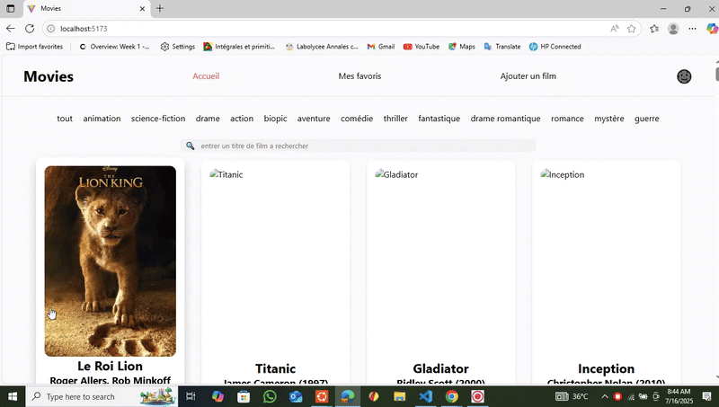
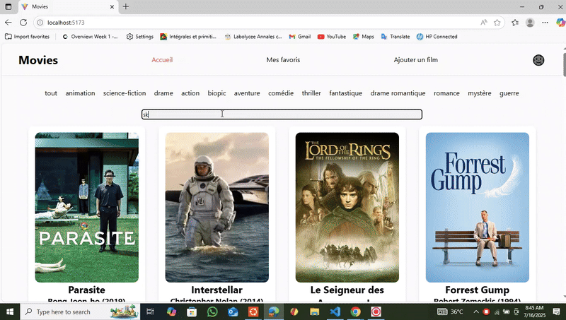

# 🎬 MovieExplorer

Un site React permettant de consulter, ajouter et gérer des films en utilisant une API locale simulée via `json-server`.  
Ce projet met l’accent sur la modularité, le style personnalisé et la persistance locale avec `localStorage`.

---

## 🖼️ Aperçu
### Aperçu de l'application




---

## 🚀 Fonctionnalités

- 🔍 Recherche de films par nom
- ❤️ Ajout et gestion des favoris
- ➕ Ajout d’un nouveau film via un formulaire
- 🌙 Mode sombre activé via Tailwind CSS
- 📱 Design responsive
- 🎭 Filtrage par genre
- 🙈 Masquage/affichage des descriptions de films

---

## 📁 Structure des routes

- `/` → Accueil (liste des films)
- `/Favoris` → Liste des films favoris
- `/Newfilm` → Ajout d’un nouveau film

---

## 🔧 Installation

1. Cloner le dépôt :
   ```bash
   git clone https://github.com/nisan95/Movies.git
   ```

2. Se déplacer dans le dossier :
   ```bash
   cd Movies
   ```

3. Installer les dépendances :
   ```bash
   npm install
   ```

4. Lancer le serveur JSON :
   ```bash
   npm run server
   ```

5. Lancer le projet React :
   ```bash
   npm run dev
   ```

---

## 🧱 Technologies utilisées

- React
- Vite
- Tailwind CSS
- JavaScript ES6+
- json-server
- localStorage

---

## 🔍 Concepts React utilisés

- `useState` pour gérer l’état des composants
- `useEffect` pour les effets de bord (fetch, initialisation)
- `fetch` pour les appels API (`GET`, `POST`, `PATCH`)
- `localStorage` pour la persistance des favoris
- Composition de composants modulaires et réutilisables

---

## 🗂️ Structure du projet

```
Movie/
├── public/
├── src/
│   ├── assets/
│   ├── components/
│   │   ├── CardFilm.jsx
│   │   ├── ListFilms.jsx
│   │   ├── Filter.jsx
│   │   ├── Search.jsx
│   │   ├── ThemeSwitcher.jsx
│   │   └── NavBar.jsx
│   ├── pages/
│   │   ├── Home.jsx
│   │   ├── Favoris.jsx
│   │   ├── NewFilm.jsx
│   │   └── NotFound.jsx
│   ├── App.jsx
│   ├── main.jsx
│   ├── route.jsx
│   ├── tailwind.config.js
│   └── index.css
├── .gitignore
├── db.json
├── eslint.config.js
├── index.html
├── package-lock.json
├── package.json
├── README.md
└── vite.config.js
```

---

## 🧑‍💻 Auteur

Projet réalisé par **Sanora Nigherson**  
Initialisé avec **Vite** — Codé avec javascript et React

---

## 📜 Licence

Ce projet est sous licence **MIT** — Utilisation libre avec mention de l’auteur.


[def]: ./src