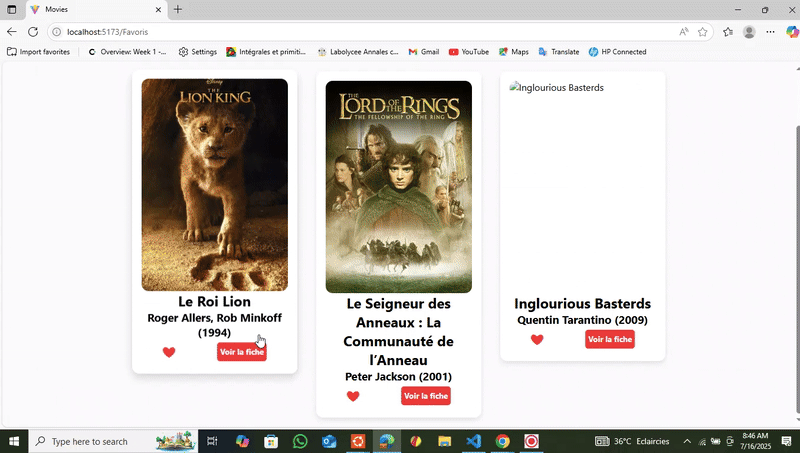

# 🎥 MovieExplorer

Bienvenue dans **MovieExplorer**, une application React qui transforme ta manière de parcourir et gérer tes films préférés.  
Ce projet est conçu comme un mini Netflix personnel 🎬 — avec recherche, ajout de films et gestion de favoris, le tout sur une API locale avec `json-server`.  

---

## ✨ Points forts

✅ Interface simple et intuitive  
✅ Mode sombre 🌙 pour le confort visuel  
✅ Gestion des favoris avec **persistance locale** via `localStorage`  
✅ Ajout facile de nouveaux films  
✅ Filtrage par genre et recherche instantanée  
✅ Design **responsive** (ordinateur, tablette, mobile)  

---

## 📸 Démonstration

Aperçu en action :  

  
  
  
  
  

---

## 🛠️ Installation & lancement

Pour tester le projet en local :

```bash
# 1. Cloner le dépôt
git clone https://github.com/nisan95/Movies.git

# 2. Aller dans le dossier
cd Movies

# 3. Installer les dépendances
npm install

# 4. Démarrer le serveur json-server
npm run server

# 5. Lancer le projet React
npm run dev
L’application est alors accessible sur http://localhost:5173/ 🚀

📂 Organisation du projet
arduino
Copier
Modifier
src/
├── assets/          # images, gifs
├── components/      # composants réutilisables (CardFilm, Search, Filter, etc.)
├── pages/           # pages principales (Home, Favoris, NewFilm, NotFound)
├── App.jsx          # composant racine
├── route.jsx        # gestion des routes
├── main.jsx         # point d’entrée
└── index.css        # style global
⚡ Technologies clés
React (hooks, composants modulaires)

Vite pour un dev rapide ⚡

Tailwind CSS pour le style moderne

json-server pour simuler une API REST locale

localStorage pour sauvegarder les favoris

📚 Concepts React appliqués
useState → gestion des états locaux

useEffect → appels API & effets de bord

fetch → communication avec json-server

localStorage → stockage persistant

Props et composition → composants réutilisables et modulaires

👨‍💻 Auteur
Projet développé par Gardin Laurient Gervais
🌱 Étudiant passionné de développement web et motivé par l’apprentissage continu.

📄 Licence
Ce projet est distribué sous licence MIT.
